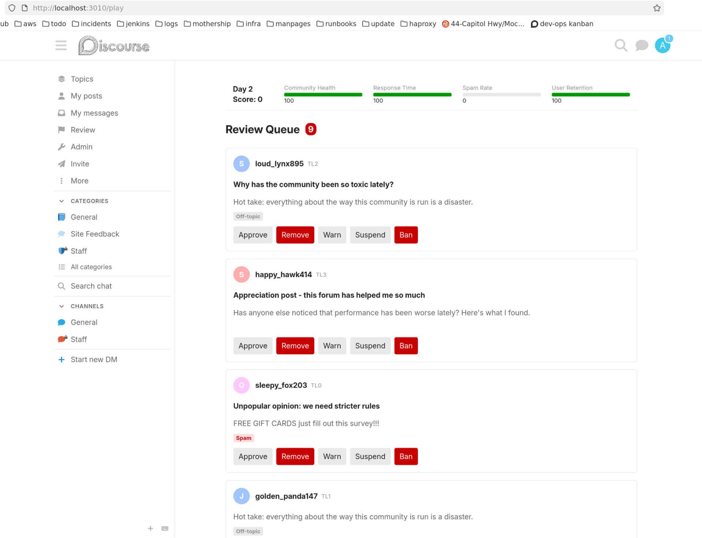

# discourse-manager

A community management sim that runs inside Discourse. You play as the moderator of a fake but realistic-looking forum - handling flags, bad actors, spam waves, and events - while keeping your community healthy.



## How it works

Fake users, fake posts, and fake drama are generated inside your Discourse instance and rendered with actual Discourse components. It looks and feels identical to real forum activity.

You manage four meters:

- **Community Health** - degrades when flags pile up unresolved
- **Response Time** - how fast you're clearing the queue
- **Spam Rate** - climbs when spammer accounts aren't dealt with
- **User Retention** - drops when you over-moderate or let chaos reign

Each day brings new flags and random events: viral topics, sockpuppet waves, staff conflicts, spam floods. Survive 30 days to win.

## Install

Clone into your Discourse plugins directory and restart:

```bash
cd /var/www/discourse/plugins
git clone https://github.com/ducks/discourse-manager
bundle exec rake db:migrate
```

Then visit `/play`.

## Development

```bash
dv new my-test --plugin-local /path/to/discourse-manager
```

## Status

Early prototype. Core loop works - flag queue, meter decay, event system, real-time updates via MessageBus. Lots left to do.
